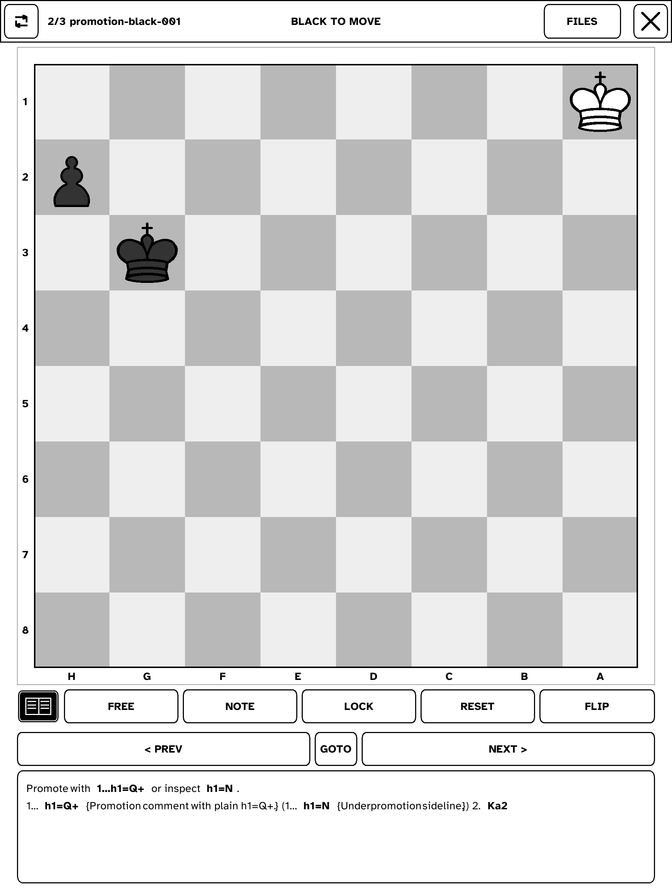

# ♟ Kindle Chess Puzzles

**A native, e-ink chess puzzle app for Kindle Scribe.** Solve tactics, browse book-style solutions, and keep your progress on a device that feels much closer to a paper chess book than a phone.

> **Current hardware target:** jailbroken **Kindle Scribe (1st generation / Barolo)**, developed and physically validated on **firmware 5.19.6**.

Kindle Chess Puzzles is written in Rust and renders directly to the Kindle framebuffer through FBInk. The shared chess and UI logic stays platform-neutral, while a thin Kindle layer handles display, touch/pen input, storage, lifecycle, packaging, and deployment.

It is intentionally **not a chess engine**. Puzzle grading follows authored solution lines, while rich analysis is prepared offline and shipped as deterministic puzzle data.

## Screenshot



## Features

- **Touch-first puzzle solving** on a full 8×8 board, with Scribe pen support for interactive solution browsing.
- **Graded Solution mode** with exact stored-line checking, automatic opponent replies, wrong-move rollback, completion feedback, and promotion choice.
- **Free Board mode** for moving pieces without grading.
- **Persistent settings panel** from the settings control beside Close, with simple ON/OFF choices for showing the Free Board and Notes toolbar buttons, plus STANDARD/SMALL board sizes. Puzzle and Game Review save these preferences independently. The smaller centered board leaves a larger panel for bigger notes and analysis text.
- **Fast navigation** with previous/next controls plus a direct **GOTO** dialog for large collections.
- **Multiple puzzle collections** with durable current-puzzle and solved progress stored separately from puzzle files.
- **Game Review resume** remembers the selected file, game and authored move across relaunch, with its own state file independent of puzzle progress.
- **Board orientation tools** including automatic side-to-move orientation, manual flip, and orientation lock.
- **Puzzle metadata** including difficulty, topics, notes/descriptions, and Cyrillic text support.
- **Rich book-style analysis** with inline PGN-style movetext, recursive variations, comments, conventional annotations (`!`, `?`, `!!`, `??`, `!?`, `?!`), and tappable move references that preview the exact position.
- **E-ink-aware rendering** with deterministic grayscale output, damage-aware refreshes, a manual Refresh control for residual ghosting, and a sleep overlay with repeatable power-button sleep/wake handling.
- **Reproducible Kindle builds and packaging** for ARMv7 / glibc 2.35, with host tests covering core logic, rendering, input contracts, lifecycle, and packaging.

Phase one (the complete Kindle puzzle experience), phase two (rich solution browsing),
and phase three (Game Review) are complete. Game Review supports offline imports
of annotated PGNs and browsing validated on the physical Scribe.

## How it works

The Kindle runtime stays deliberately small. Puzzle solving, rendering, and analysis browsing are normal Rust code; platform-specific behavior is pushed to the edge.

```text
                         app/kindle-chess
                         event loop + composition
                           /            \
                          v              v
                 chess-core         chess-render
              board / puzzles      Gray8 rendering
              app state / progress layout / hit testing
              rich analysis        damage tracking
                          \              /
                           v            v
                         kindle-platform
                 input / storage / lifecycle
                              |
                              v
                           fbink-sys
                              |
                              v
                    FBInk + Kindle framebuffer
```

The workspace is split into four main crates:

- **`chess-core`** — FEN/UCI board model, puzzle parsing, solution state, collections, progress, versioned settings, and rich-analysis state.
- **`chess-render`** — deterministic e-ink layout/rendering, hit testing, pieces, text, and damage regions.
- **`kindle-platform`** — Kindle display presentation, Linux touch/pen input, paths, device lifecycle, and power integration.
- **`fbink-sys`** — the raw FBInk FFI boundary.

Rich solutions are authored/imported **offline**. A host-side PGN converter validates moves and emits JSON with precomputed positions, so the Kindle needs neither a PGN parser nor a chess engine to jump through variations.

The architecture is intentionally reusable: a future Kobo backend should be able to replace the platform adapter without forking the chess model or renderer.

## Build & deploy

From a fresh checkout:

```sh
git submodule update --init --recursive
scripts/check.sh
scripts/build-kindle.sh
scripts/stage-kindle.sh
```

Deploy to a configured Scribe over SSH:

```sh
scripts/deploy-kindle.sh --host root@DEVICE_IP --port 2222
```

With Scriptlets/SH_Integration installed, the packaged app can be launched from the Kindle library as **Kindle Chess Puzzles**.

For the full setup and recovery procedure, see [Build & Deploy](docs/BUILD_DEPLOY.md).

To import review games, install the host dependencies in a virtual environment
(`python3 -m pip install -r requirements-tools.txt`), then run:

```sh
python3 tools/pgn_review_converter.py my-games.pgn -o games-my-games.json --title "My games"
```

Copy the JSON to `/mnt/us/kindle-chess/games/` while the app is closed, relaunch,
and tap the workspace icon beside Refresh. Use GAMES to select a game, PREV/NEXT
to follow its main line, or tap moves to preview variations. See
[Game Review import/update](docs/GAME_REVIEW_IMPORT.md) for setup, safe updates,
stable IDs, Free Board behavior, and rollback. Physical review-mode acceptance passed on 2026-10-07.

## Project notes

The project grew from the behavior of [eink-chess-app](https://github.com/abavelski/eink-chess-app), while replacing the original runtime architecture with a portable Rust core and Kindle-specific adapters.

Useful deep dives:

- [Architecture](docs/ARCHITECTURE.md)
- [Kindle Scribe notes](docs/KINDLE_SCRIBE.md)
- [Puzzle format](docs/PUZZLE_FORMAT.md)
- [Rich solution browsing](docs/PHASE_2.md)
- [Measured device results](docs/RESULTS.md)
- [Implementation task history](tasks/README.md)

Chess piece artwork comes from the **Sashité Western** SVG set and is converted into deterministic e-ink-friendly assets during development.
